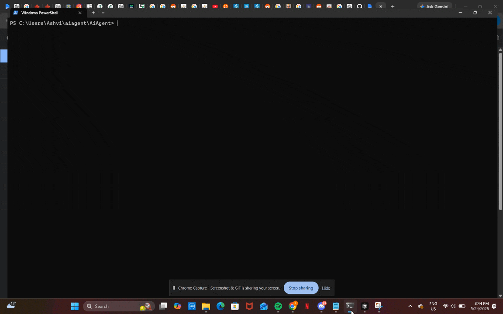
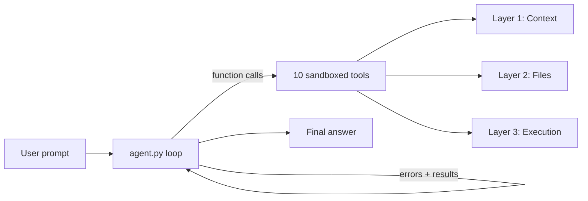

# AI Coding Agent

autonomous AI agent that maps repositories, edits code, runs tests, and self corrects until you have working code, built with Gemini function calling and a sandboxed tool layer.

## Demo



*The agent maps the project, runs the calculator tests, and reports results.*

**Text demo:** see [examples/fix-calculator-tests.md](examples/fix-calculator-tests.md) for a full transcript of whats happening in the code

## What This Project Does

- Uses Gemini function calling to let the agent interact with tools and the filesystem
- Safely handles file access using sandboxed path validation and a restricted working directory
- Supports iterative agent loops where the model can inspect code, make changes, rerun programs, and verify fixes
- Includes a multi-turn chat mode with persistent conversation history
- Allows the agent to read errors from failed executions and attempt self-correction automatically
- Includes automated tests for file operations, execution safety, path handling, and agent utilities

## Quickstart

```bash
git clone https://github.com/Ashvinan19/AiAgent.git
cd AiAgent
uv sync
```

Create `.env`:

```env
GEMINI_API_KEY=your_api_key_here
```

Run the agent (by default, it is sandboxed to the current working directory):

```bash
uv run main.py "List the top-level files in this project"
```

run bundled calculator demo:

```bash
uv run main.py "Run the calculator unit tests" --working-dir ./calculator --verbose
```

start Interactive chat (history persists between turns):

```bash
uv run main.py --chat --working-dir ./calculator
```

## Architecture



| Layer | Tools | Purpose |
|-------|--------|---------|
| **1. Context** | `get_project_tree`, `get_files_info`, `get_file_content`, `grep_files` | Map and search the codebase |
| **2. Files** | `write_file`, `edit_file`, `format_file` | Create, patch, and format code |
| **3. Execution** | `run_python_file`, `run_command`, `install_dependencies` | Run scripts, shell commands, pip install |
| **4. Self-correction** | `agent.py` + `prompts.py` | Investigate → fix → verify loop |

## Examples

Recorded agent workflows (prompt → tools → outcome):

| Example | Description |
|---------|-------------|
| [fix-calculator-tests.md](examples/fix-calculator-tests.md) | Agent maps the repo, runs tests, and verifies |
| [explain-codebase.md](examples/explain-codebase.md) | Q&A without unnecessary tool calls |
| [add-feature.md](examples/add-feature.md) | Agent adds a small feature with `edit_file` |

## CLI

```bash
# Quick one-off task
uv run main.py "List the Python files in this project"

# Coding workflow against a target project
uv run main.py "Run the calculator tests and fix any failures" \
  --working-dir ./calculator --require-success --verbose

# Interactive chat — history persists across turns
uv run main.py --chat --working-dir ./calculator
```

| Flag | Default | Description |
|------|---------|-------------|
| `--chat` | off | Interactive mode; history persists until `/clear` or `/exit` |
| `--working-dir` | `.` | Sandboxed project root |
| `--max-iterations` | `20` | Max agent loop turns **per user message** |
| `--require-success` | off | After modifying code, block final answer until a command exits 0 |
| `--verbose` | off | Print token usage and full tool results |

**Chat commands:** `/exit` quit · `/clear` reset history · `/help` show commands

## Project structure

```text
AiAgent/
├── agent.py                 # Event-driven agent loop
├── main.py                  # CLI entry point
├── call_function.py         # Tool dispatch + schema registry
├── config.py                # Limits, ignore patterns, defaults
├── prompts.py               # System prompt
├── functions/               # One tool per file
│   ├── path_utils.py        # Sandbox path resolution (security boundary)
│   ├── subprocess_utils.py
│   └── ...
├── tests/                   # pytest suite (tools + session handling)
├── calculator/              # Demo sandbox project
├── examples/                # Recorded agent transcripts
└── .github/workflows/ci.yml
```

## Development

```bash
# Run tests
uv sync --all-groups
uv run pytest

# Lint
uv run ruff check .
```

## Limitations

- **Context window** — long chat sessions grow token usage; use `/clear` to reset history
- **File truncation** — files capped at 10,000 characters; no smart file ranking or summarization
- **Sandbox scope** — `cwd`-locked execution, not a container/isolated VM
- **Single LLM** — Gemini only; no provider abstraction layer

## Future Implementation Roadmap

- [ ]  UI on top of `run_agent()` events
- [ ] Smart context selection (file ranking / summarization)
- [ ] Unified diff tool (`apply_patch`)

## Built with

Python 3.14 · [Gemini API](https://ai.google.dev/) (`google-genai`) · [uv](https://docs.astral.sh/uv/) · [ruff](https://docs.astral.sh/ruff/) · [pytest](https://docs.pytest.org/)

## License

MIT — see [LICENSE](LICENSE).
