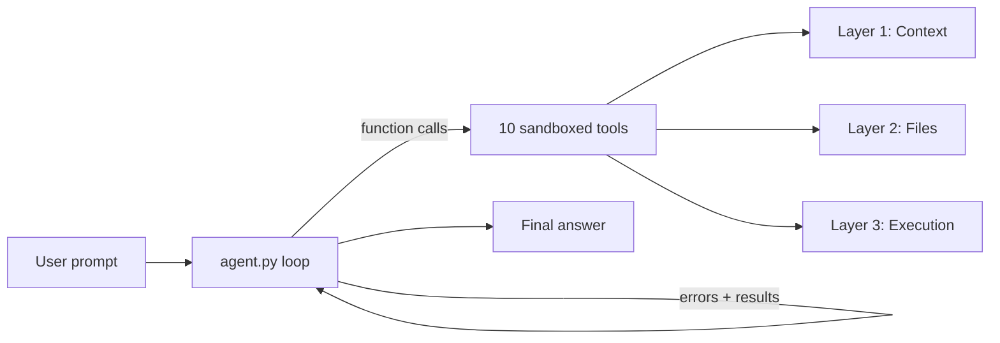

# AI Coding Agent

An autonomous AI agent that maps repositories, edits code, runs tests, and self corrects until you have working code, built with Gemini function calling and a sandboxed tool layer.

## Demo


*The agent maps the project, runs the calculator tests, and reports results.*

**Text demo:** see [examples/fix-calculator-tests.md](examples/fix-calculator-tests.md) for a full tool-call transcript.

## What This Project Does

- **LLM tool use**: 10 function-calling tools wired through `google-genai`
- **Sandboxed execution**: every file path resolved with `commonpath`; commands run inside a locked working directory
- **Agent loop**: event-driven loop in `agent.py` with optional success-gated iteration (`--require-success`)
- **Self-correction**:the model reads STDERR, patches code, and reruns until verification passes
- **Tested tooling**:41 pytest assertions across path sandboxing, edits, grep, and execution

## Quickstart

```bash
git clone https://github.com/Ashvinan19/AiAgent.git
cd AiAgent
uv sync
```

Create `.env`:

```env
GEMINI_API_KEY=your_api_key_here
```

Run the agent (sandbox defaults to the current directory):

```bash
uv run main.py "List the top-level files in this project"
```

Target the bundled calculator demo:

```bash
uv run main.py "Run the calculator unit tests" --working-dir ./calculator --verbose
```

## Architecture



| Layer | Tools | Purpose |
|-------|--------|---------|
| **1. Context** | `get_project_tree`, `get_files_info`, `get_file_content`, `grep_files` | Map and search the codebase |
| **2. Files** | `write_file`, `edit_file`, `format_file` | Create, patch, and format code |
| **3. Execution** | `run_python_file`, `run_command`, `install_dependencies` | Run scripts, shell commands, pip install |
| **4. Self-correction** | `agent.py` + `prompts.py` | Investigate → fix → verify loop |

## Examples

Recorded agent workflows (prompt → tools → outcome):

| Example | Description |
|---------|-------------|
| [fix-calculator-tests.md](examples/fix-calculator-tests.md) | Agent maps the repo, runs tests, and verifies |
| [explain-codebase.md](examples/explain-codebase.md) | Q&A without unnecessary tool calls |
| [add-feature.md](examples/add-feature.md) | Agent adds a small feature with `edit_file` |

## CLI

```bash
# General task on current directory
uv run main.py "Find all TODO comments in Python files"

# Point at a specific project
uv run main.py "Fix the failing test" --working-dir ./calculator

# Keep iterating until the last command exits 0 (only after code changes)
uv run main.py "Fix tests and verify" --working-dir ./calculator --require-success

# Verbose: token usage + full tool output
uv run main.py "Explain how the calculator works" --working-dir ./calculator --verbose

# Hard tasks: more loop iterations
uv run main.py "Refactor the parser" --max-iterations 30
```

| Flag | Default | Description |
|------|---------|-------------|
| `--working-dir` | `.` | Sandboxed project root |
| `--max-iterations` | `20` | Max agent loop turns |
| `--require-success` | off | After modifying code, block final answer until a command exits 0 |
| `--verbose` | off | Print token usage and full tool results |

## Project structure

```text
AiAgent/
├── agent.py                 # Event-driven agent loop
├── main.py                  # CLI entry point
├── call_function.py         # Tool dispatch + schema registry
├── config.py                # Limits, ignore patterns, defaults
├── prompts.py               # System prompt
├── functions/               # One tool per file
│   ├── path_utils.py        # Sandbox path resolution (security boundary)
│   ├── subprocess_utils.py
│   └── ...
├── tests/                   # 41 pytest assertions
├── calculator/              # Demo sandbox project
├── examples/                # Recorded agent transcripts
└── .github/workflows/ci.yml
```

## Development

```bash
# Run tests
uv sync --all-groups
uv run pytest

# Lint
uv run ruff check .
```

## Limitations

- **One-shot CLI** — each invocation is a single prompt; no multi-turn chat session yet
- **Context window** — files truncated at 10,000 characters; no smart file ranking or summarization
- **Sandbox scope** — `cwd`-locked execution, not a container/isolated VM
- **Single LLM** — Gemini only; no provider abstraction layer
- **Demo recording** — add `docs/demo.gif` for a visual README demo (see [Recording a demo](#recording-a-demo))

## Recording a demo

1. Install dependencies and set `GEMINI_API_KEY` in `.env`.
2. Run:
   ```bash
   uv run main.py "Run calculator unit tests and fix any failures" --working-dir ./calculator --verbose
   ```
3. Record the terminal (Windows: **Win+G** Xbox Game Bar, or [ScreenToGif](https://www.screentogif.com/)).
4. Save a 20–30s clip as `docs/demo.gif` (keep under ~5 MB).
5. Uncomment the image line in the **Demo** section above.

Alternatively, use [asciinema](https://asciinema.org/) on Linux/macOS/WSL and embed the player link.

## Roadmap

- [ ] Streamlit UI on top of `run_agent()` events
- [ ] Multi-turn conversation session
- [ ] Smart context selection (file ranking / summarization)
- [ ] Unified diff tool (`apply_patch`)

## Built with

Python 3.14 · [Gemini API](https://ai.google.dev/) (`google-genai`) · [uv](https://docs.astral.sh/uv/) · [ruff](https://docs.astral.sh/ruff/) · [pytest](https://docs.pytest.org/)

## License

MIT — see [LICENSE](LICENSE).
